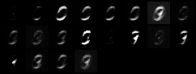
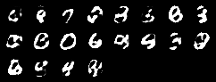
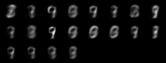
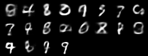
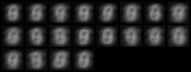
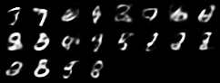

# VAE code

This is an implementation of VAE and its variations, applied to image and text data

## How to use
* Python >= 3.6 is required
* Install requirements
```
$ pip install -r requirements.txt
```
* Run the model (VAE)
```
$ python3 main.py --model vae --dataset mnist --ninput 784 --nlatent 20 --nhidden 400
```


## Examples (MNIST data)
* VAE (Image)

  
 
  ##### epoch 1
 
  
  
  ##### epoch 10

* AAE (Image)

  
 
  ##### epoch 1
 
  
  
  ##### epoch 20
  
* ARAE (Image)

  
 
  ##### epoch 1
 
  
  
  ##### epoch 20

## References
* Papers
  1. [Auto-Encoding Variational Bayes (VAE)](https://arxiv.org/abs/1312.6114)  
  2. [Adversarial Autoencoders (AAE)](https://arxiv.org/abs/1511.05644)
  3. [LSTM VAE](https://arxiv.org/abs/1511.06349)
  4. [Adversarially Regularized Autoencoders (ARAE)](https://arxiv.org/abs/1706.04223)
  5. [Neural Discrete Representation Learning (VQ VAE)](https://arxiv.org/abs/1711.00937)

* Codes
  1. [Pytorch VAE](https://github.com/pytorch/examples/tree/master/vae)
  2. [Pytorch AAE](https://github.com/bfarzin/pytorch_aae)
  3. [Pytorch Sentence VAE](https://github.com/timbmg/Sentence-VAE)
  4. [Pytorch VQ VAE](https://github.com/zalandoresearch/pytorch-vq-vae)


